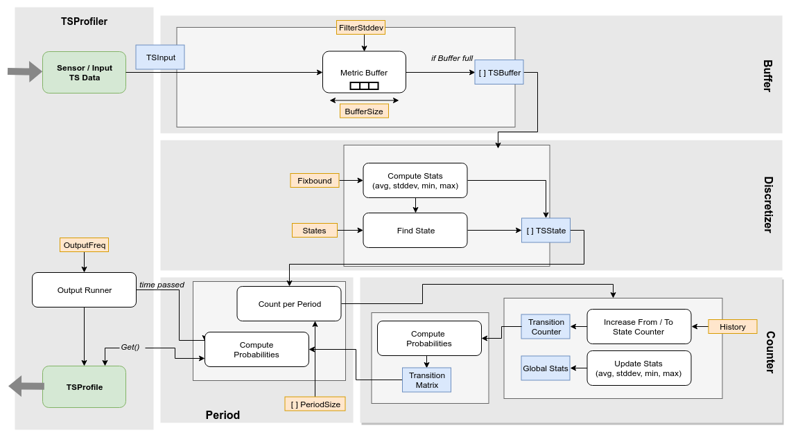

# TSProfiler

*a profiler for time series data* - **breaking changes may occur, since currently under development.**

[](https://travis-ci.org/cha87de/tsprofiler)
[](https://godoc.org/github.com/cha87de/tsprofiler/impl)

```
+------------+       +------------+      +---------------+
| TimeSeries | +---> | TSProfiler | +--> |  Statistical  |
|    Data    |       |            |      |    Profile    |
+------------+       +------------+      +---------------+
```

## Purpose

*TSProfiler* provides a go implementation to convert time series stream data
like monitoring data online into statistical representative profiles. TSProfiler
is integrated into the KVM monitoring tool
[kvmtop](https://github.com/cha87de/kvmtop/tree/profiler).

The core concept bases on *Markov Chain*s to represent the probability of a
discretized utilisation states, and a *Decision Tree* to handle periodic
recurrent Markov transition matrices.




## Usage Guide

### Command line tool **csv2tsprofile**

The TSProfiler comes with a command line tool to read a CSV file and generate a TSProfile. [Get the most recent stable build from Releases.](https://github.com/cha87de/tsprofiler/releases).

Usage:

```
Usage:
  csv2tsprofile [OPTIONS]
Reads time series values from a CSV file and generates a tsprofile
Application Options:
      --states=
      --buffersize=
      --history=
      --filterstddevs=
      --fixedbound
      --fixedmin=          if fixedbound is set, set the min value (default: 0)
      --fixedmax=          if fixedbound is set, set the max value (default:
                           100)
      --periodsize=        comma separated list of ints, specifies descrete
                           states per period (default: 60,720,1440)
      --periodchangeratio= accepted ratio [0,1] for changes, alert if above
                           (default: 0.2)
Help Options:
  -h, --help               Show this help message

```

Example: `csv2tsprofile --states 4 --history 1 --filterstddevs 4 --buffersize 6 --periodsize 2,24,48 path/to/tsinput.csv`

### Integrate into Go Code via TSProfiler API

Create a new TSProfiler:

```go
profiler = tsprofiler = profiler.NewProfiler(models.Settings{
		Name:          "profiler-hostX",
		BufferSize:    10,
		States:        4,
		FilterStdDevs: 4,
		History:       1,
		FixBound:      false,
		PeriodSize:    []int{60,720,1440},
		OutputFreq:     time.Duration(20) * time.Second,
		OutputCallback: profileOutput,		
	})

func profileOutput(data models.TSProfile) {
  // handle profiler output via OutputFreq
}

// get profile independently of OutputFreq
profile := profiler.Get()
```

Provide metric value to profiler:

```go
metrics := make([]models.TSInputMetric, 0)
metrics = append(metrics, models.TSInputMetric{
		Name:  "CPU-Util",
		Value: float64(utilValue),
		FixedMin: options.FixedMin, // optional, required for FixBound = true
		FixedMax: options.FixedMax, // optional, required for FixBound = true
	})
tsinput := models.TSInput{
		Metrics: metrics,
	}
profiler.Put(tsinput)
```
