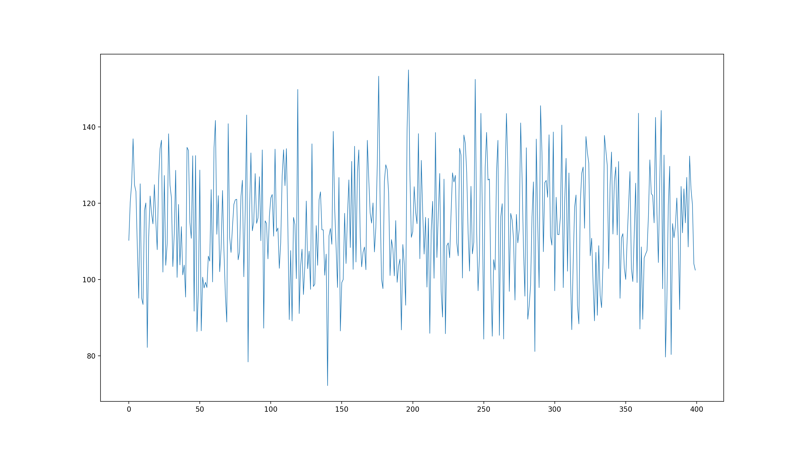
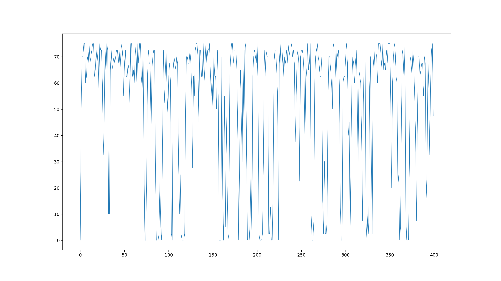

# Evaluation of TSProfiler

How to run an evaluation cycle with TSProfiler:

1. provide offline time series input data in tsinput.csv
2. generate profile via `go run main.go > profile.json`
3. plot tx matrix and a simulation with `./plotProfile.py profile.json example`

## Evaluation Output

1. the tx matrix

2. a simulation using average and standard deviation

3. a simulation using the tx matrix
