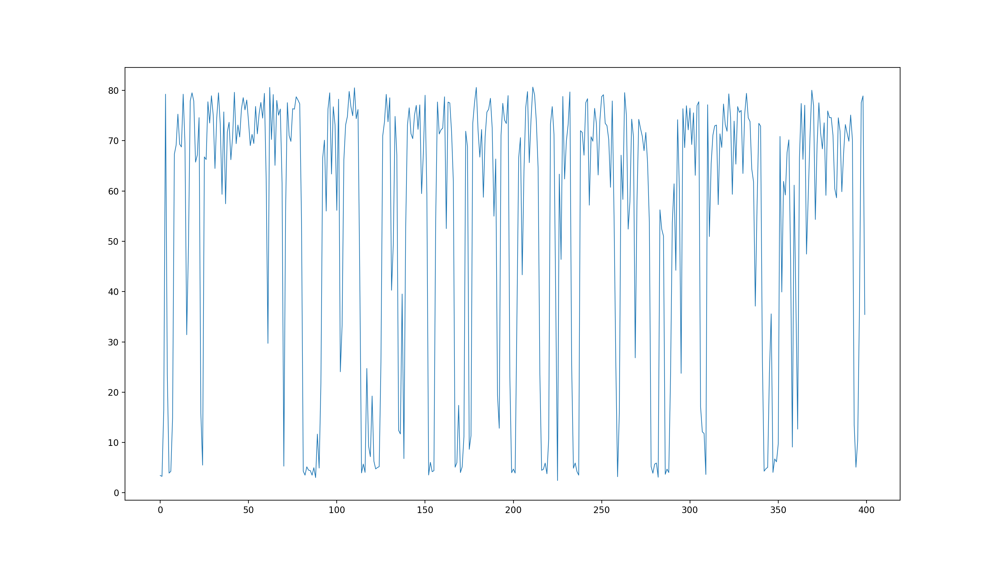

# Evaluation of TSProfiler

How to run an evaluation cycle with TSProfiler:

1. provide offline time series input data in tsinput.csv, download csv2tsprofile from [releases](https://github.com/cha87de/tsprofiler/releases)
2. generate profile via `csv2tsprofile tsinput.csv > profile.json`
3. plot tx matrix and a simulation with `./plotProfile profile.json metric_1`
4. evaluate diff between simulation and actual measurements with `./evalDiff`

**Original time series**

CPU Utilisation


**Profile Output**

```json
{"name":"tsinput","metrics":[{"name":"metric_1","txmatrix":[[94,4,0,2],[17,67,17,0],[0,7,55,38],[0,1,15,84]],"stats":{"min":0,"max":100,"stddev":0.4044010715284039,"avg":11.7645295056}}]}
```


**Simulation using average and standard deviation**

Eval Diff: TODO


**Simulation using the tx matrix**

Eval Diff: TODO

